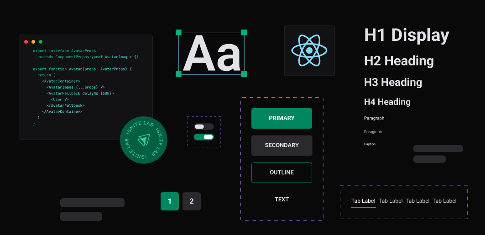

<h1 align="center">
  
</h1>

<h1 align="center">
  Design System
</h1>

<p align="center">
  
  
  
  
  <a href="https://github.com/daviteixeira-btm/design-system/commits">
    
  </a>
  
  

  
	 
</p>
<p align="center">
  <a href="#-about-the-project">About the project</a>&nbsp;&nbsp;&nbsp;|&nbsp;&nbsp;&nbsp;
  <a href="#-technology">Technology</a>&nbsp;&nbsp;&nbsp;|&nbsp;&nbsp;&nbsp;
  <a href="#-installation-execution-and-development">Installation, execution and development</a>&nbsp;&nbsp;&nbsp;|&nbsp;&nbsp;&nbsp;
  <a href="#-how-to-contribute">How to contribute</a>&nbsp;&nbsp;&nbsp;|&nbsp;&nbsp;&nbsp;
  <a href="#-license">License</a>
</p>

## 👨🏻‍💻 About the project
```👨🏻‍💻 Sobre o projeto```
<p>Construção de um Design System do Figma ao React.</p>

<p>
  Link do Storybook: <a href="https://daviteixeira-btm.github.io/design-system/">Ver link</a>
</p>

<p>
  Link do Figma: <a href="https://www.figma.com/file/YvLvnTKuVkjjpQizMeRDxG/Ignite-Lab-Design-System?node-id=0%3A1">Ver link</a>
</p>

## 🚀 Technology
```🚀 Tecnologias```

- [Storybook](https://storybook.js.org/)
- [Figma](https://www.figma.com/)
- [React](https://pt-br.reactjs.org/)
- [Radix-ui](https://www.radix-ui.com/)
- [Tailwind](https://tailwindcss.com/)

## 💻 Installation, execution and development
```💻 Instalação, execução e desenvolvimento```

### Prerequisites
```💻 Pré-requisitos```

- [npm](https://www.npmjs.com/)
- [Node.js](https://nodejs.org/en/)

## 🤔 How to contribute
```🤔 Como contribuir```

**Fork the repository and follow the steps below**<br>
```Faça um fork deste repositório e siga os passos a baixo```

```bash
### Clone your fork
# Clone seu fork
$ git clone seu-fork-url && cd NOME_DO_REPO

### Create a branch with your feature
# Crie uma branch com sua feature
$ git checkout -b my-feature

### Commit your changes
# Faça commit das suas alterações
$ git commit -m 'feat: My new feature'

### Send the code to your remote branch
# Envie o código para sua remote branch
$ git push origin my-feature
```
**After your pull request is merged, you can delete your branch** <br>
```Depois que sua pull request for merged, você pode deletar sua branch```

## 📝 License

This project has a MIT License - see the [LICENSE](./ LICENSE) for more details.<br>
```Este projeto possui uma Licença MIT License - veja o arquivo [LICENSE](./LICENSE) para mais detalhes.```

---

<div align="center">

Made with ❤️ by Davi Teixeira

</div>
